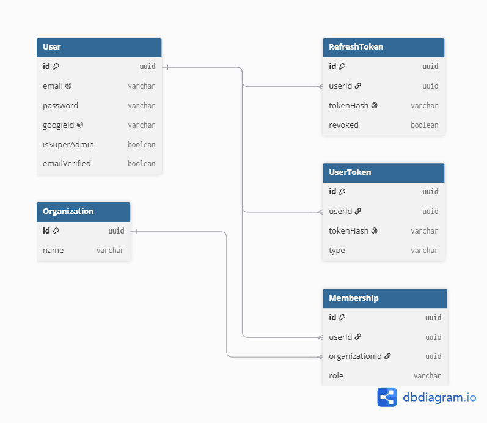

# Multi-Tenant SaaS Backend

NestJS backend for a multi-tenant project-management SaaS: JWT auth with rotating
refresh tokens, Google OAuth, email verification, password reset, and
role/permission-based tenant isolation for Organizations and Memberships.

## Tech stack
- NestJS + TypeScript
- PostgreSQL + Prisma ORM (driver adapter: `@prisma/adapter-pg`)
- Passport (JWT + Google OAuth 2.0 strategies)
- Vitest for e2e tests

## Setup

\`\`\`bash
npm install
cp .env.example .env   # fill in your own values
npx prisma migrate dev
npm run start:dev
\`\`\`

API docs: `http://localhost:3000/docs` (Swagger UI)

## Architecture

- `auth/` — register, login, refresh rotation, logout, email verification,
  password reset, Google OAuth
- `organizations/` — organizations + memberships, tenant-scoped CRUD
- `permissions/` — the `Permission` enum and the static role → permission map
- `common/` — guards (`OrgMembershipGuard`, `PermissionsGuard`), decorators
  (`@RequirePermissions`, `@CurrentUser`), and the global exception filter
- `prisma/` — schema and generated client

## Auth flow

- Access tokens are short-lived (15 min) JWTs. Refresh tokens are long-lived,
  stored in the DB **only as a SHA-256 hash**, and rotate on every use.
- **Reuse detection:** if an already-used (or unknown) refresh token is
  presented, every refresh token for that user is revoked — this covers the
  case of a stolen token being replayed after the legitimate user has
  already rotated past it.
- Logging out revokes only that session's token; logout-all revokes every
  session for the user.
- Password reset revokes all of a user's sessions, since the credential that
  protected them has changed.

## Tenant isolation

- Every organization-scoped route reads the organization id from the URL
  (`:id`), never from the request body — `ValidationPipe({ whitelist: true })`
  strips any unexpected field (like an injected `organizationId`) before it
  reaches a handler.
- `OrgMembershipGuard` checks the caller has a `Membership` in that
  organization before any handler runs; `PermissionsGuard` then checks their
  role against the required `Permission` for that route.
- A `Membership` id from a different organization always resolves to `404`,
  not `403` — this prevents confirming that the row exists elsewhere
  (see the IDOR tests in `test/app.e2e-spec.ts`).
- `SUPER_ADMIN` is a platform-level flag on `User`, independent of any
  organization membership.

## Known limitations

- Email delivery is mocked (logged to the server console) rather than sent
  via a real provider — swap `AuthService.sendMail` for a real mailer
  (e.g. Nodemailer) to send real emails.
- Revoked access tokens remain valid until their 15-minute expiry, since JWTs
  are stateless; only refresh tokens are checked against the database.

## ERD

## Tests

\`\`\`bash
Unit tests: npm test
E2E tests: npm run test:e2e
\`\`\`

13 e2e tests cover auth, refresh rotation/reuse detection, tenant isolation,
IDOR protection, and RBAC guards.